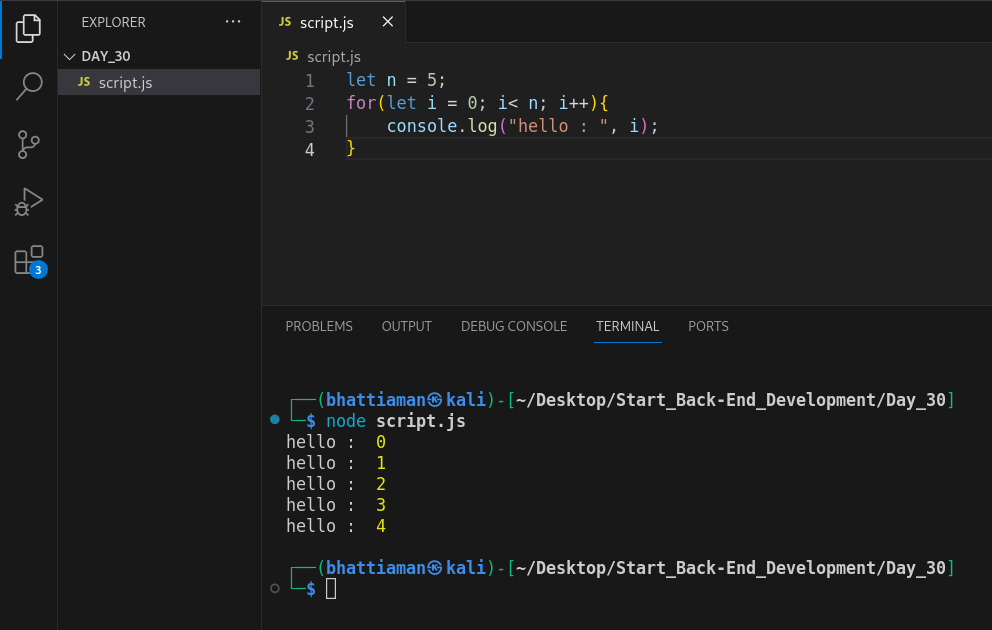
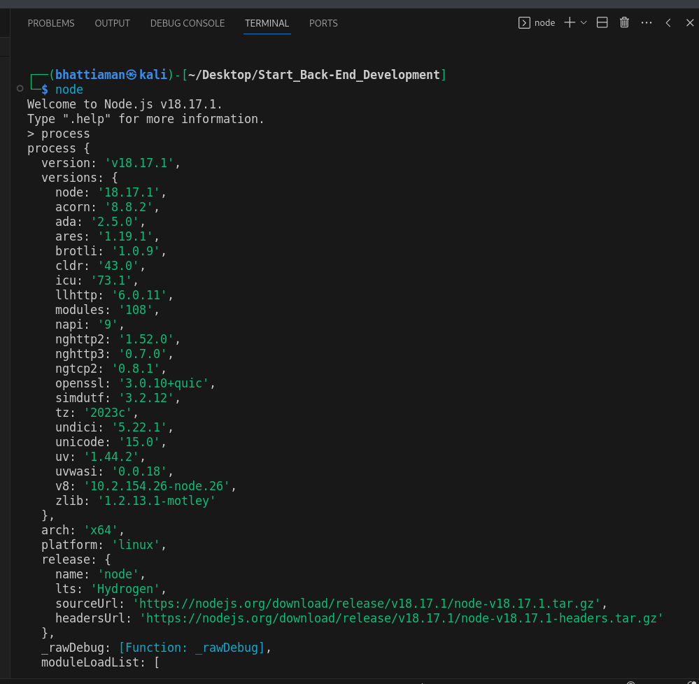
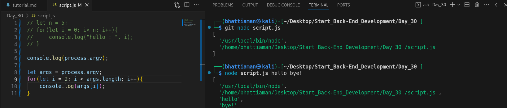
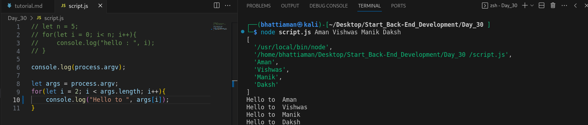
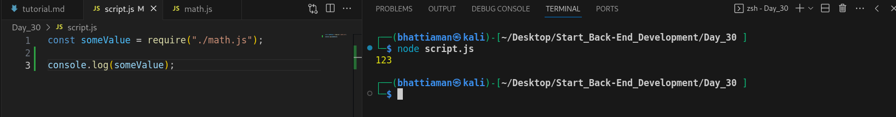
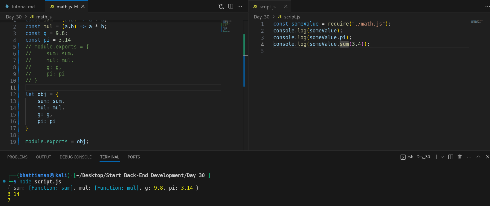

## Day 30 : Node js:

         Java Script Runtime Environment.  
         It is use for server side programming.  
         Node js is not a language it is a library or a framework.

### let n = 5;
###    for(let i = 0; i< n; i++){
###        console.log("hello : ", i);
###    }

 

## Process :

        This object provide information about, and control over, the current Node.js process.

## Process.argv :
        returns an arrau containing the command line arguments passed when the Node.js process was launched.

## Pass the arguments 

## Pass the arguments return something in all argument

## Export the file function

        export the function of other file function from math.js file to  script.js 
        In math.js file use ** module.exports = "" **
        In script.js use ** require("") ** function

<!-- git add --all
git commit -m "update"
git push -->