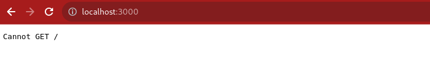

## Day_31 : Express

### Diff. between Library vs Framework
    A library is a collection of pre-written code that can be used to perform specific tasks. ex => axios

    A framework is a collection of pre-written code that can provides a structure for developing software application. ex => express.

### Express : 
    A Node js web application framework that help to make web appilcations.
    It is used for server side programming.
    **Use**
    1) listen for incoming request
    2) parse the data
    3) match response with routes
    4) response
### Getting started with Express || How to create web api's using express
**Create a Srver**
```
const express = require("express");
const app = express();
// console.dir(app);
let port = 3000;

// listen if a function which is listen the request port
app.listen(port, () => {
    console.log(`app listening on port ${port}`);
});

```



