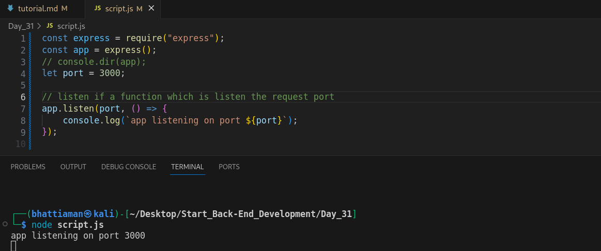
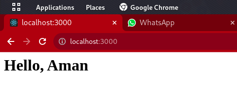

## Day_31 : Express

### Diff. between Library vs Framework
    A library is a collection of pre-written code that can be used to perform specific tasks. ex => axios

    A framework is a collection of pre-written code that can provides a structure for developing software application. ex => express.

### Express : 
    A Node js web application framework that help to make web appilcations.
    It is used for server side programming.
    **Use**
    1) listen for incoming request
    2) parse the data
    3) match response with routes
    4) response
### Getting started with Express || How to create web api's using express
**Create a Srver**
```
const express = require("express");
const app = express();
// console.dir(app);
let port = 3000;

// listen if a function which is listen the request port
app.listen(port, () => {
    console.log(`app listening on port ${port}`);
});
// Request recived if ant request is come on port 3000 port.(for try use "Hoppscotch") "Hoppscotch" it is use for send the request on localhost port.
app.use((req, res) => {
    //console.log(req);
    console.log("Handling the respones");

    // In send function we send html(tags), string, code
    // res.send("This the first response");
    //console.log(req);
    let code = "<h1>Hello, Aman</h1>";
    res.send(code);

});
```

### Run on Localhost 


## Routing
    fixed the path where you want to show the content

### function
**important path** => app.get("*",(req,res){ }) //"*" means it valid for every undefine path page
    1. app.get("path",(req,res){});


